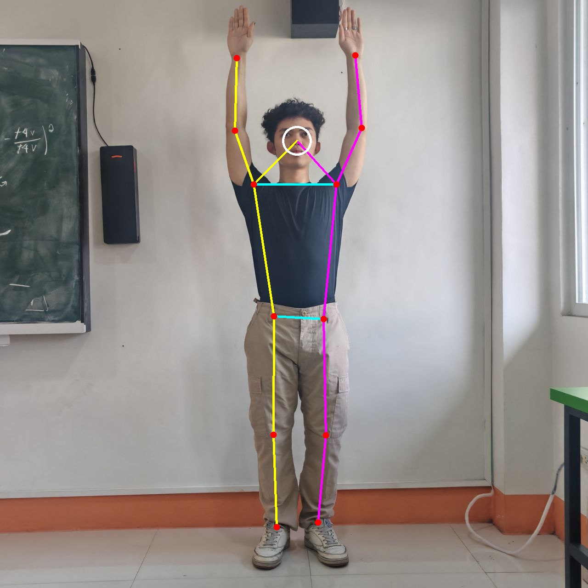
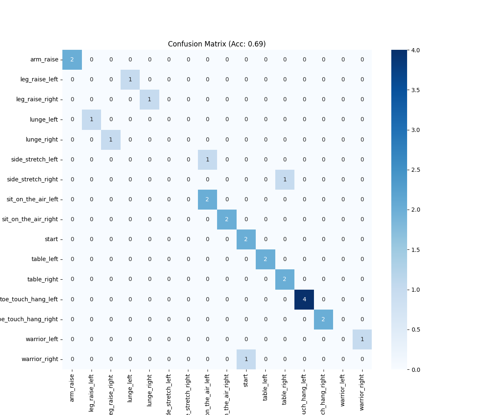

# Guided Pose Program

Guided Pose Program is a college finals project focused on pose-guided exercise assistance using computer vision, TensorFlow Lite pose estimation, and audio/visual feedback.

## Overview

The project uses a pose-estimation model to compare a user's live movement against expected exercise poses, then provides on-screen and audio-based guidance. It also includes supporting scripts for generating estimates, evaluating model behavior, and packaging the application for Windows use.

## Main Features

- Pose-guided exercise feedback
- TensorFlow Lite model integration
- Audio cue system for guided instructions
- GUI-driven exercise flow
- Evaluation and estimate generation utilities
- Windows packaging helper scripts

## Preview

### Sample Pose Estimate



### Evaluation Output



## Project Structure

- `main_v3_finalfix.py`: latest main application entry point
- `main_v3_final.py`: alternate later-stage application version
- `main.py`: earlier main program flow
- `model.py`: pose model loading helpers
- `feedback_system.py`: guidance and feedback logic
- `gui_manager.py` / `gui_manager_v2.py`: interface management
- `audio_assets/`: generated voice prompts and feedback audio
- `imagedatabase/`: image-based project data
- `model_estimates/`: generated pose estimate data
- `evaluation_results/`: saved evaluation output
- `packaging/`: Windows packaging helpers

## Requirements

- Python 3.11+
- Webcam access

Install dependencies:

```bash
pip install -r requirements.txt
```

Run the latest version:

```bash
python main_v3_finalfix.py
```

## Notes

- The repository includes the local `model.tflite` file required by the project.
- Packaging output under `packaging/build/` is intentionally excluded from version control.
- This project is being preserved as a finals project and portfolio piece.
